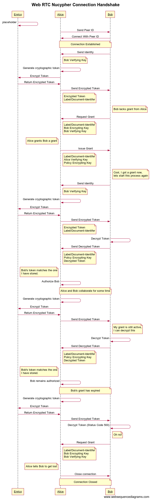

# Technical Specification

This document outlines the technical aspect of how the different pieces of the application work

## Managing Text Across Different Peers

Making sure all peers are synced with the correct data is a difficult task in itself. You may have heard of the term [Operational Transform](https://en.wikipedia.org/wiki/Operational_transformation), which is a protocol for managing conflicts and operational state between peers in a collaborative session.

For the purposes of this Hackathon, I simply leveraged the [Automerge](https://github.com/automerge/automerge) library for managing the syncing and [Slate](https://github.com/ianstormtaylor/slate) for the rendering aspect. Kudos to this fellow who made a [bridge](https://github.com/humandx/slate-automerge) between slate and automerge.

## Interaction with Swarm

To upload documents to Swarm I used the [Erebos](https://erebos.js.org/docs/examples-feeds) library. What is nice about Swarm are <i>feed updates</i>, which essentially lets me easily make changes to the document without changing the URL itself.

The doucment that is uploaded to swarm is the serialized variant of the automerge document. When loaded, the document is deserialized back into an automerge document.

There are many caveats when it comes to using Swarm or decentralized file storages in general.

Heres what happens when you try to fetch a document from Swarm

1. 404 Not Found (No Feed Updates found)
2. Connection Timeout (takes 10 years to load)
3. Document is outdated (probably fetched from a node that hasnt received the new document)
4. Correct Document fetched

Due to this kind of uncertainity, what I did was basically have my application fetch the document mutliple times. If its a `404`, refetch, up to a maximum of X. If a document is found, apply a `SHA256` on it and store the hash with a counter. Increment the counter if needed. 

Since it is expected the most up to date document will be fetched the most often, once a document's hash reaches a certain counter threshold, we can assume it is the most recent one.

This is not always the case, and I needed to strike a balance between the threshold, so you wouldn't be waiting an eternity for th e document to fetch.

## Web RTC Nucypher Connection Handshake

